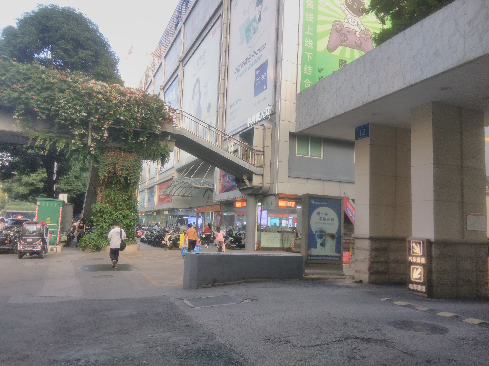

在电商还没有统治装机市场的那个年代，每一个城市的“电子科技广场”、“百脑汇”或者“赛博数码城”，都是硬件发烧友眼中的圣地，同时也是最险恶的奸商聚集地。

那时候电脑城还没有那么冷清，直到最近移动互联网兴起，传统电脑在普通人群中逐渐失去存在的必要。最近我在整理旧笔记时，翻到了当年的电科广场十字诀，感觉很有意思:

**一二楼在忽悠人，奸商最多这两层。**

**电梯两侧不能碰，全是奸商在坑人。**

**板好却又不试机，一看心中就有诈。**

**电脑城里斗心计，永远都在亏大钱。**

**以为自己很明智，实际奸商不是人。**

## 一二楼在忽悠人，奸商最多这两层。

走进任何一家电脑城，一楼和二楼永远是采光最好、人流量最大、装修最奢华的区域。这里租金往往最高，如果不在客人身上宰一点什么的话，铁定亏本（况且现在还是移动互联网时代，客流比以往最繁华的时候还会更少，几乎是来一个宰一个）。

你在网上查好了一套配置，算下来要 5000 元。一楼的导购热情地把你迎进去，看了一眼配置单说：“哥们，你这配置拿高了，我这只要 4200 元！”等你兴高采烈地开单付了定金，大坑就来了。

师傅会突然一脸严肃地走过来告诉你：“哎呀老板，你选的这个主板/显卡和 CPU 兼容性有问题，容易烧主板；或者刚好断货了。我强烈建议你换成某冒牌的产品，性能更强，便宜 200！”实际上，他们推荐的那款是利润对半开的积压库存或者缩水山寨，清库存的。

## 电梯两侧不能碰，全是奸商在坑人。

因为这黄金地段。任何想上三楼、四楼（通常是批发商或散件档口）的顾客，都必须经过扶梯。

守在电梯两侧的导购，像牛皮糖一样黏着你，抢走你手里的配置单，或者用极度夸张的语气否定你的选择：“哟，现在谁还买这个啊？走，去我店里，带你看最新的。”

一旦你被他们从电梯口拉走，进入他们的柜台，在那种嘈杂、高压的环境下，普通人的心理防线很容易崩溃，最后为了脱身只能草草签字付款。

## 板好却又不试机，一看心中就有诈。

你以为你精明地看清了每一个配件的包装盒，就万无一失了吗？

奸商最恨的就是现场试机。他们会找各种理由：“柜台没有测试电源”、“我们这都是原封正品，回去点不亮随时拿来换”。

只要你同意“不试机直接带走”，往往就是盲盒。

比如当年的 GTX 970，给你拿一个频率缩水的丐版，甚至用 GTX 560 刷 BIOS 伪造显示名称。水洗得雪白、显存渗油擦得干净的“纯血战将RX580三朝矿老”，直接塞进新包装盒里假装是新的。

## 电脑城里斗心计，永远都在亏大钱。

很多新手去电脑城之前，会在贴吧、论坛做足几天功课，以为自己掌握了核心科技，可以去和老板“斗心计”砍价。

但普通玩家用“爱好”去挑战奸商的“饭碗”本就是很不公平的。砍低了 CPU 的价格，他就会在根本没有透明价格的“山寨电源”和“山寨散热器”上把利润成倍地加回来。盯紧了每一个大件，他就在最后的“装机手工费”或者“线材费”上扎一刀。

在这种信息不对称的战场上，主动去和他们玩心理战，结局往往是被全方位割韭菜。

## 以为自己很明智，实际奸商不是人。

当年每一个从电脑城出来、抱着主机在公交车上沾沾自喜，觉得自己“砍价成功、赚大发了”的少年，回到家拆开机箱，对照着软件测试结果时，大概率都会破口大骂一句：“这群奸商真不是人！”

## 一个时代的落幕

我偶然翻出了这一段《电科广场十字诀》不仅是一份防坑指南，更是移动互联网爆发前夕，线下零售业野蛮生长一段缩影。

如今，各地的电脑城大多已经转型成了卖大疆无人机、新能源车或者纯粹的维修档口。当年的那些套路，也随着京东、淘宝和厂商直播间的兴起，变成了历史的眼泪。现在再去电脑城早已人去楼空，但是宰客套路依旧不断，最后劣币驱逐良币，进入恶性循环。

回望过去，那个充满汗水、塑料包装味、以及柜台前讨价还价的实体电脑城时代，终究是彻底死去了。它没有死于电商的降维打击，而是死在了自己永无止境的贪婪与信息高墙里。

时代抛弃它时，甚至连一句再见都没说。

如今，我坐在屏幕前，看着 Steam 2026 年六月的的硬件调查报告。屏幕上那行亮黄色的 GTX 970 依然傲立在排行榜的前列，它是我当年从那个喧嚣的江湖里带出来的老兵。它顶着“3.5G 显存”的古老调侃，陪我度过了许多 Debug 的日夜，也见证了移动互联网的兴起。

江湖已经人去楼空，大厂的高墙也越筑越高。但只要这台老主机的风扇还在转动，那个属于DIY爱好者的世界，就不会迎来终点。