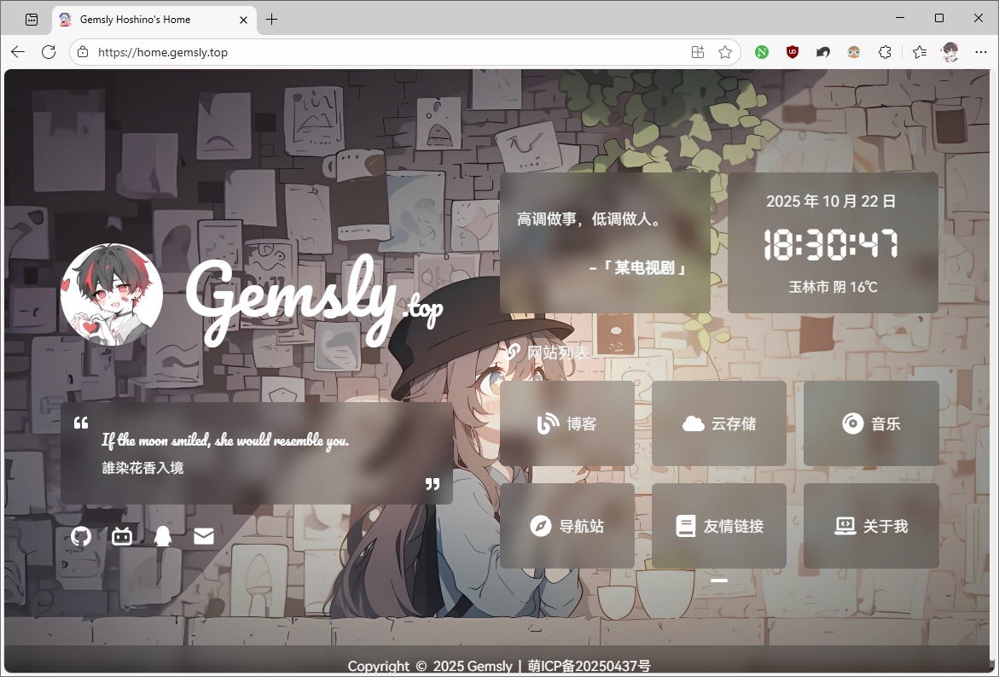
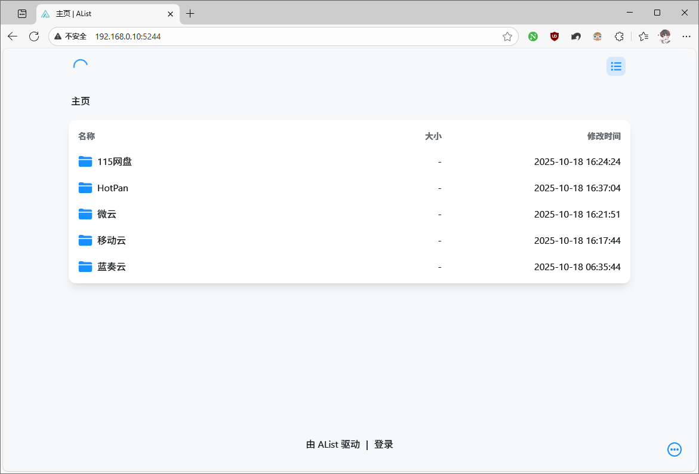
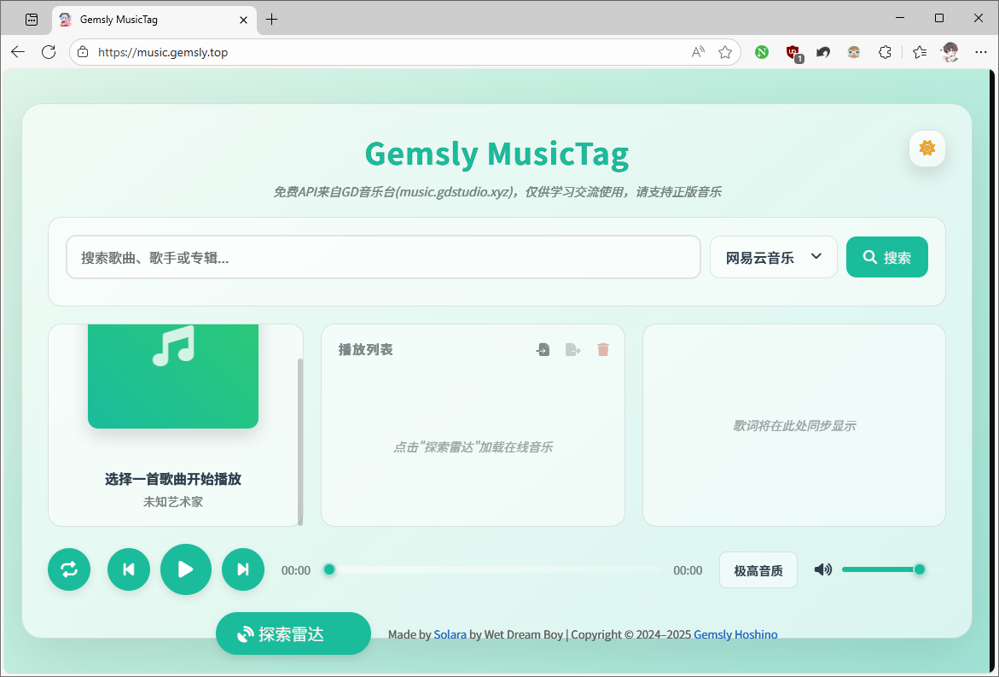
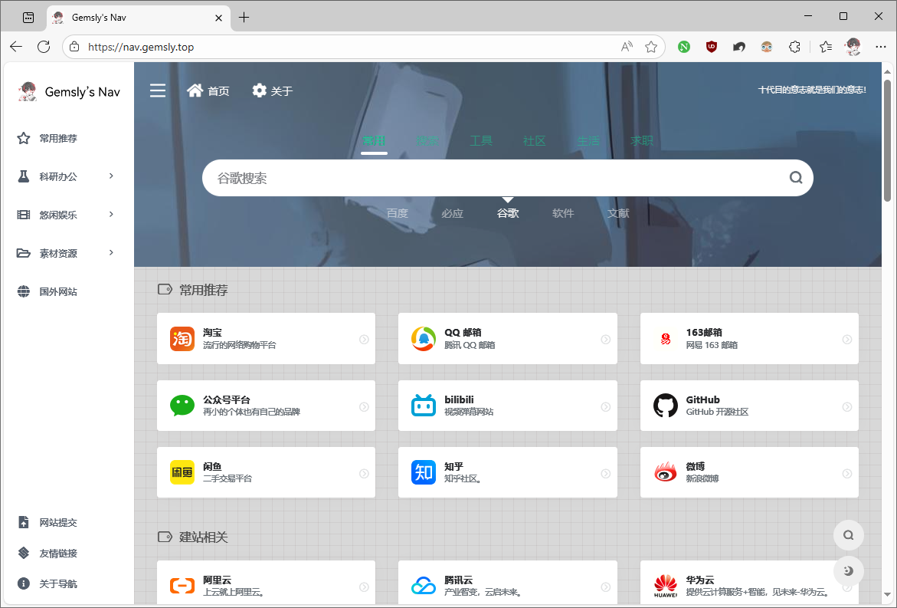
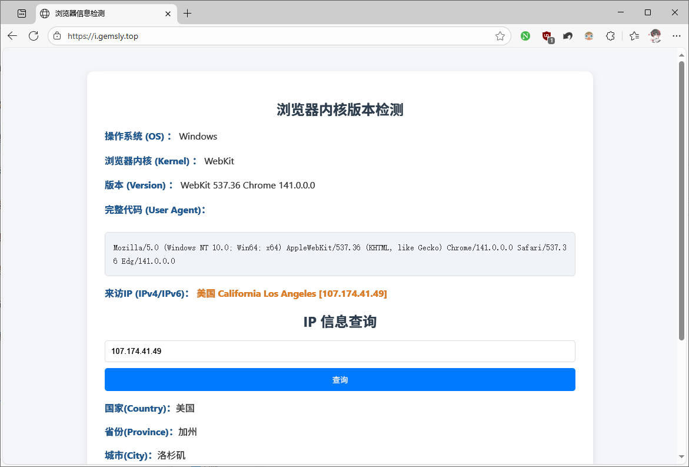

+++
published = 2025-10-22
draft = false
title = '本站小工具和二级页面合集'
description = "汇总本站提供的博客、个人中心、云存储、音乐播放、网址导航、性能检测等实用工具及二级页面，包含各服务的访问地址与功能说明"
tags = ["建站"]
category = "技术研究"
pinned = true
+++

## 本站小工具和二级页面合集

### 1.博客(本站主页)

[https://blog.gemslyho.org](https://blog.gemslyho.org)

本站核心内容展示平台，聚焦技术研究、建站心得、经验分享等博客文章，是浏览本站核心资讯的主要入口。

### 2.主页

[https://home.gemslyho.org](https://home.gemslyho.org)

个人服务聚合中心，整合了本站所有核心功能的快捷跳转入口，同时展示个人基础信息与动态，便于高效访问各服务模块。

### 3.云存储(OpenList)

[https://oplist.gemslyho.org](https://oplist.gemslyho.org)

基于OpenList搭建的多功能云存储管理工具，对接自己存储，访客可用文件分发和下载功能。

### 4.音乐(Solara)

[https://music.gemslyho.org](https://music.gemslyho.org)

基于Solara框架开发的在线音乐播放平台，支持自定义播放列表创建及歌词同步显示。

### 5.导航站（WebStack）

[https://nav.gemslyho.org](https://nav.gemslyho.org)

采用WebStack模板构建的实用网址导航工具，按工具、学习、生活等类别收录网站链接。

### 6.浏览器内核检测小工具

[https://ie.gemslyho.org](https://ie.gemslyho.org)

轻量级检测工具，可实时监测浏览器内核版本、IP 属地。

