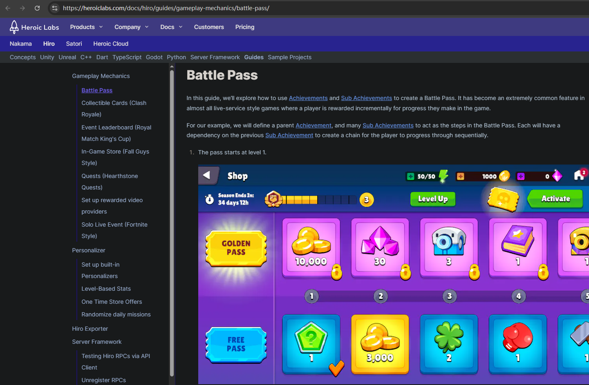

最近在各类社交平台上，看到太多账号被 Meta 或其他巨头无预警封禁、申诉无门的故事。我突然意识到：把所有的信任和数字资产，全部压在任何一个由资本控制的中心化平台上，不做任何本地化备份和冗余，是一件极其危险的事。

既然社交账号尚且如此，它至少还有内容在里面；那我们投入成百上千小时、甚至成千上万块钱的“强制联网网游”呢？那些看似属于我们的角色、皮肤、武器、进度、情感记忆，又算什么？

为此，我提出了一个“本地化假设”（The Local Host Test）：
**“假设把这些大厂网游完全搬到本地服务器上，它还值钱吗？”**

这个百试百灵的照妖镜，直接把米哈游、腾讯等所有免费内购（GaaS）游戏的底裤扒了下来，露出了它们荒诞的逻辑死锁。

## “本地化假设”：百试百灵的照妖镜

游玩之前，假设我已经成功把某款热门网游完整搬到了自己的**本地服务器**：完全断网、数据归你掌控、服务器由你一人说了算，没有任何外部干预。

这时，游戏立刻陷入一个终极的两难死锁（Paradox）：

#### 选择 A：开启控制台

一键输入 /give all，瞬间获得满命满精、无限原石/抽卡、顶级装备。你会发现，所谓的大世界解谜、战斗策略、养成系统瞬间变得浅薄得令人发指。精心设计的“探索感”崩塌成空洞的像素堆砌，战斗只剩下无聊的数值碾压。

#### 选择 B：手动硬肝

你像正常玩家一样，每天花 3 小时跟着攻略跑图、开箱子、刷材料、做每日任务。然而，在没有全网共识、没有排行榜、没有好友点赞、没有社交炫耀的前提下，这种重复劳动立刻显露本质：给空气织毛衣。智商和时间被无情折磨。

#### 结论

现代网游的所谓“好玩”，必须建立在“故意折磨你、卡你脖子”的前提之下；其“资产价值”，必须依赖于官方的脆弱定义和全网玩家的集体共识。一旦本地化，人为制造的稀缺性便瞬间崩塌。

## 三位一体：为 DAU 而生

当游戏被搬回本地服务器，大厂为了榨取日活跃用户（DAU）而设计的三大武器，瞬间原形毕露：

#### 第一重枷锁：每日任务（赛博皮鞭）

在本地服务器里，它变成了每天对着自己电脑请安的仪式，仿佛不完成这几个简单任务，就会损失什么实际存在的东西。

#### 第二重枷锁：限时活动（电子栅栏）

利用 FOMO（Fear Of Missing Out，恐惧错过）机制，剥夺玩家时间主权。在本地服里，你居然在自己给自己设置“限时14天不打就删代码”的自残闹剧。没有人逼你，服务器里只有你一个人，却依然像被无形栅栏圈养的动物。

#### 第三重枷锁：限定卡池（虚拟证券）

人为制造“稀缺性”和流动性危机，来压榨玩家的钱包。在本地服里对着本地随机数生成器抽出的 0.6% 概率，进行深度自我催眠，试图说服自己“这次出货真的有意义”。

## Battle Pass：“付费上班”？

大厂用几行几乎不需要额外成本的“空气代码”，就能换取玩家实打实的真金白银。服务器里多一个皮肤、多一把武器，对他们来说毫无成本（边际上来说），但对玩家却是真金白银的支出。
主要是沉没成本绑架：

**传统消费**：你给钱，对方交货，玩家至少还算“上帝”。

**战令消费**：玩家先交一笔“入职费”（买通行证），然后每天准时上线，像上班打卡一样完成各种绩效指标（每日任务、周常、活动）。最后，大厂用他们自己印的虚拟道具“发工资”——而这些工资，玩家还得继续花钱、花时间去“解锁”。**厂商不仅得到了钱，还获得了忠实的 DAU，简直是双赢。**

在本地化假设下，你会发现自己居然花钱雇自己，每天准时给一台本地服务器“上班”，就为了解锁一些自己随时可以修改的代码。这不是消费，这是自我剥削。

## 巨头对比：“泡沫破裂” vs “瞬间气化”

不同的商业逻辑，在本地化假设下，游戏的贬值速度和残值完全不同，这也暴露了它们真正的核心资产到底是什么。

#### 单人/弱社交 GaaS（泛指二游）：

本地化后，虽然玩法深度和数值资产迅速归零，但至少还留下了可观的“精神资产”——精美的美术、角色模型、音乐和场景设计。它能退化成一个高配的“3D 互动式散步模拟器”或电子画册。泡沫会破裂，但不会彻底爆炸，至少还能留下一些审美价值。

#### 强竞技/强社交：

情况则惨烈得多。它们的核心资产从来不是游戏内容本身，而是社交关系链和排位天梯的官方规则共识。

一旦搬到本地服务器，面对毫无灵性的机器人，“赢”失去了定义，段位和炫耀也失去了观众。没有剧情和探索作为支撑，整个游戏会变成一地鸡毛。连“散步”的资格都没有。

## 最后

所谓的‘免费’，从来都是有代价的。你付出的不只那一纸契约，而是你的时间自主权、注意力，以及对数字资产所有权的让渡。当这些代价超出了那份‘认同感’的收益时，你的‘免费’其实已经变得极其昂贵。

当然，这本身是一笔交易。如果你愿意为了这份社交认同和即时满足感付费，并且确实收获了纯粹的快乐，那这笔消费就是值得的。我们尊重这种自然选择。这个观点也仅代表我个人的看法，无可否认，这也是一种成功的商业手段。

我提倡把有限的时间，留给那些真正尊重用户、不卡体力、不逼打卡的买断制优秀独立作品，以及开源、自由、可本地化的项目；

或者带入现实生活，去创造真正属于自己的、不可被随意封禁、清空的所有权。

赛博世界里的“资产”终究是一场烟花。

现实世界里的时间、技能、关系、创造，才是主线任务。

*使用 AI 辅助写作，核心观点由自己提出*